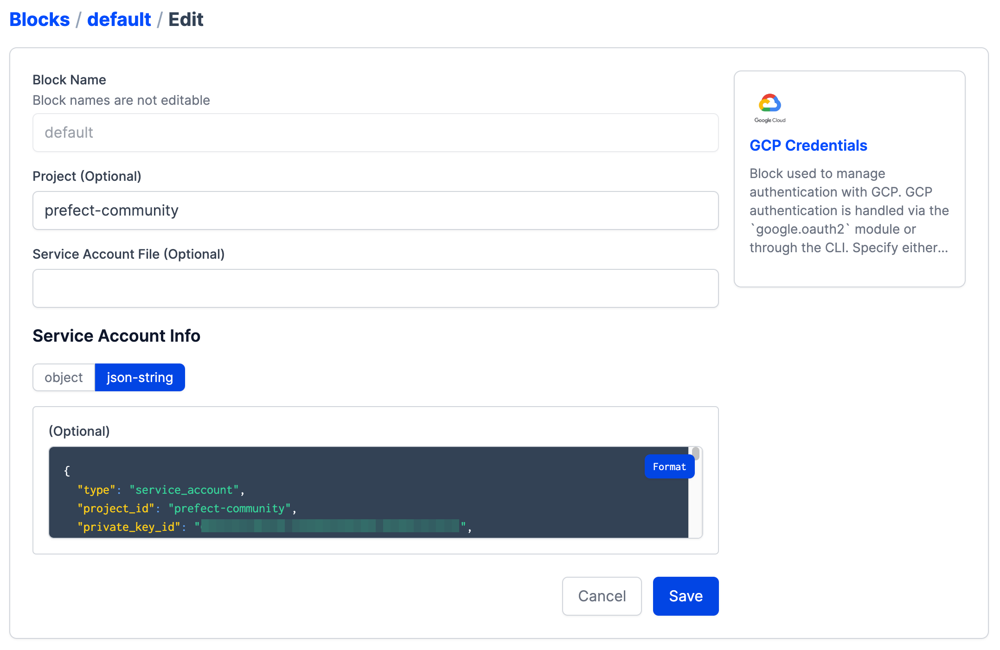

# Workflow ochestration with Prefect 

## Setup

### 1. Clone the repo

Clone the repo locally.

### 2. Install packages

```bash
pip install -r requirements.txt
```
### 3. Start the Prefect Orion server locally

Start the Orion API server with 

```bash
prefect orion start
```

### 4. Set up GCP 

- Log in to [GCP](https://cloud.google.com/)
- Create a Project
- Set up Cloud Storage
- Set up BigQuery
- Create a service account with the required policies to interact with both services

### 5. Register the block types that come with prefect-gcp

`prefect block register -m prefect_gcp`

### 6. Create Prefect GCP blocks

Create a *GCP Credentials* block in the UI.

Paste your service account information from your JSON file into the *Service Account Info* block's field.



Create a GCS Bucket block in UI 

Alternatively, create these blocks using code by following the templates in the [blocks](./blocks/) folder. 

### 7. Write a flow script

Write python code in flow folder to ingest data and add `@flow` and `@task` decorators. 

### 8. Create deployments

Create and apply your deployments.

### 9. Run a deployment or create a schedule

Run a deployment ad hoc from the CLI or UI.

Or create a schedule from the UI or when you create your deployment.

### 10. Start an agent

Make sure your agent set up to poll the work queue you created when you made your deployment (*default* if you didn't specify a work queue).

## Later: create a Docker Image and use a DockerContainer infrastructure block

Bake your flow code into a Docker image, create a DockerContainer, and your flow code in a Docker container.
